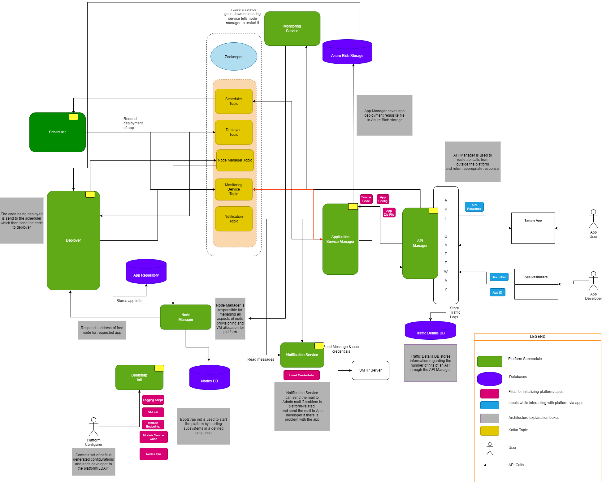

# IoT-Application-Hosting-Platform (IAHP)

The IoT-Application-Hosting-Platform (IAHP) streamlines the process for users to set up and manage digital applications across diverse domains. With seamless integration capabilities, it connects effortlessly with various data sources and leverages the oneM2M platform for comprehensive data collection. Designed for optimal user experience, IAHP boasts flexible configurations, robust security measures, and efficient resource utilization.

## Table of Contents

1. [Introduction](#introduction)
2. [Features](#features)
3. [Functional Requirements](#functional-requirements)
4. [Non-Functional Requirements](#non-functional-requirements)
5. [External Interface Requirements](#external-interface-requirements)
6. [Folder Structure](#folder-structure)
7. [Microservices Details](#microservices-details)
8. [Demo Video](#demo-video)
9. [Architecture Diagram](#architecture-diagram)
10. [Future Scope](#future-scope)
11. [Getting Started](#getting-started)
12. [License](#license)
13. [Contributing](#contributing)

## Introduction

**IoT-Application-Hosting-Platform (IAHP)** simplifies the process of running and managing digital applications. It allows users to:

- **Connect Easily**: With a range of sensors, it's versatile for various digital scenarios.
- **Gather Data**: Using the oneM2M platform, it collects data from diverse sources.
- **Dynamic Configuration**: IAHP understands application needs from configuration files, ensuring optimal setup and performance.
- **User Flexibility**: Adjustments and settings can be modified to suit individual requirements.

Its primary mission is to assist businesses in deploying and overseeing large digital projects. Features include:

- **Device Connectivity**: Seamless integration with multiple devices.
- **Data Management**: Efficient handling and storage of collected data.
- **Real-time Insights**: Provides valuable, timely information for better decision-making.

## Features

- Real-time data analysis from various IoT sensors.
- Effective anomaly detection mechanism.
- RESTful APIs for seamless data access.
- Standardized machine-to-machine communication using OneM2M.
- Integration capabilities with AWS/Azure for resource management.

## Functional Requirements

### **Application**

- API-driven **Sensor Interaction** with integrated sensor manager.
- Independent **App Development** leveraging platform APIs.
- Unique ID-based **Sensor Identification**.
- Efficient **Data Binding** from sensors to applications.

### **Communication**

- Scalable **Message Handling** with reliable delivery.
- Robust **Access Management** using authentication/authorization.

### **Server & Deployment**

- Automated server initiation on new app deployment.
- **Monitoring** capabilities with strong **Security** (API keys, LDAP, JWT).

### **Load Balancing**

- Methods and tools for even microservice distribution.

### **Module Interactions**

- Coordinated modules via communication, data sharing, and control mechanisms.

### **Packaging & Configuration**

- Bundled packaging of essential files.
- Flexible **Configurations** in XML or JSON.

### **Actors**
- Devices process and act based on platform data.

## Non-Functional Requirements

### **Fault Tolerance**

- **Platform:** Achieve redundancy through multiple instances to handle potential failures.
- **Application:** Seamless error handling to ensure uninterrupted user experience.

### **Scalability**

- **Platform & Application:**
  - Modular architecture.
  - Horizontal scaling.
  - Asynchronous processing.
  - Utilize Kafka for distributed architecture, replication, and high throughput.

### **Accessibility of Data**

- **Application:** Use REST APIs for data access.
- **Sensors:** Integration of OneM2M with ThingsBoard for standardized data management and MQTT for receiving data.

### **Application Specifications**

- **Reliability:** Consistent performance with minimal failures.
- **Performance:** Optimal speed, throughput, and response time.
- **Usability:** Intuitive design that caters to user needs.

### **Interaction Interfaces**

- Terminal-based UI for platform interaction.

### **Security**

- Password-based authentication.
- LDAP for authorization.

### **Monitoring**

- Utilize ThingsBoard.io server-side APIs for secure monitoring and control of IoT entities.

### **Persistence**

- Approaches under consideration:
  - File-based persistence.
  - Relational and non-relational databases.

## External Interface Requirements

- OAuth support for authentication.
- APIs for managing bare metal resources from AWS/Azure.

## Folder Structure

The project is organized as follows:

- **`project-root-directory/`**
  - **`client/`**
    - `src/`: Client-side source files for the UI and interactions.
  - **`server/`**
    - `Application-Service-Manager/`: Manages and verifies the applications and services.
    - `Bootstrap/`: Initial setup and configurations for the platform.
    - `Logger/`: Logging utilities for tracking system activities.
    - `api-manager/`: Manages the API endpoints and routing.
    - `api/`: API endpoints and related functionality.
    - `docs/`: Documentation and guides for the platform.
    - `extras/`: Additional utilities and helper scripts.
    - `load-balancer/`: Distributes incoming traffic across services for optimal performance.
    - `monitoring-service/`: Monitors the health and performance of services.
    - `node-manager/`: Handles node-related operations and lifecycle.
    - `notification-manager/`: Manages notifications and alerting.

## Microservices

### **1. API Gateway**

- **Function**: Serves as the entry point for all incoming requests, handling authentication, request routing, and load balancing.
- **Key Features**: Token-based authentication, rate limiting, and SSL termination.

### **2. Application Service Manager**

- **Function**: Manages the initial processing of application deployments, including verification and storage.
- **Key Features**: Verifies **`app.zip`** content, integrates with Azure Blob for storage, and interfaces with Kafka for message passing.

### **3. Application Lifecycle Manager**

- **Function**: Handles the entire lifecycle of hosted applications, from deployment to maintenance and scaling.
- **Key Features**: Coordinates with the Deployer for application setup and status updates.

### **4. Deployer**

- **Function**: Responsible for the physical deployment of applications, including environment setup and execution.
- **Key Features**: Communicates with Node Manager for resource allocation and updates AppDB with deployment status.

### **5. Scheduler**

- **Function**: Manages the scheduling of application deployments based on predefined schedules.
- **Key Features**: Interfaces with the Application Service Manager and Deployer via Kafka topics.

### **6. Node Manager**

- **Function**: Allocates and manages nodes for application deployment.
- **Key Features**: Efficient resource management and node allocation for Deployer.

### 7. **Bootstrap Service**

- **Functionality :** The Bootstrap Service is a critical component responsible for initializing and configuring the other components of the Application Hosting Platform.It acts as a setup script or service that activates and sets up each component with the necessary configurations and interdependencies.
- **Key Features**
    - **Automatically starts** up all the core components of the platform in the correct order ,
    - **Configuration Management** Sets up each component with predefined or dynamic configurations.
    - **Dependency Checks**: Ensures that all dependencies among various services are resolved before they are made operational.
    - **Health Checks**: Performs initial health checks to verify that each component is functioning correctly after startup.
- **Working**
    - Upon activation by the Platform Administrator, the Bootstrap Service sequentially starts each component, such as the Application Service Manager, Deployer, and others.
    - It ensures that the necessary configurations are applied, and inter-component communications pathways (like Kafka topics) are established.
    - The service also conducts initial checks to confirm that each component is running and ready to perform its designated role.

## Architecture Diagram

To understand the structural layout and interdependencies of the platform components, refer to the architecture diagram. It gives a comprehensive view of the system design, making it easier for users and developers to grasp the platform's intricacies.

## Demo Video

Get a firsthand experience of the Distributed IoT Application Platform in action. Click the video below to watch the demo:

<https://github.com/bhanujggandhi/iot-platform-project/assets/41260948/70dd75a6-11cc-42a9-814d-ee760bd8a3ef>

## Getting Started

Welcome to our IoT platform, designed to manage, process, and visualize data from various connected devices with a keen focus on fault tolerance, scalability, and security. Here's how you can get started:

### 1. **Setup Instructions**

- **Platform Installation:**

  - Clone the project repository.
  - Navigate to the project directory.

- **Application Deployment:**
  - Ensure your application meets platform compatibility requirements (OS, programming language, dependencies).
  - Deploy your application using the provided deployment script or tools.
  - More details are availableat docs on deployment. You can refer that.

### 2. **Dependencies**

- **Kafka:** Our platform relies heavily on Kafka for distributed architecture, replication, and high throughput.

  - [Download Kafka](https://kafka.apache.org/downloads)
  - Follow the installation guide specific to your operating system.
  - Start the Kafka server and create topics as needed.
  
### 3. **Configuration**

- **Application Configuration Files:**

  - Navigate to the configuration directories of each microservices(e.g., `./config/`).
  - Adjust default settings in XML or JSON format files as per your application needs.

- **Platform Security:**

  - Set up password-based authentication or LDAP as needed.
  - Ensure API keys for platform APIs are safely stored and used.

- **Sensor Registration:**
  - Register your sensors on the IoT platform.
  - Make note of unique sensor IDs and metadata for interaction with applications.

By following the above steps, you should have the platform up and running, ready to process and visualize data from your IoT devices. For further assistance, refer to our detailed documentation or reach out to our support team.

## contributing

Feel free to explore the source code repository, watch the demo video, and refer to the communication and architecture diagrams to get a better understanding of the Distributed IoT Application Platform.

## License

MIT License.
